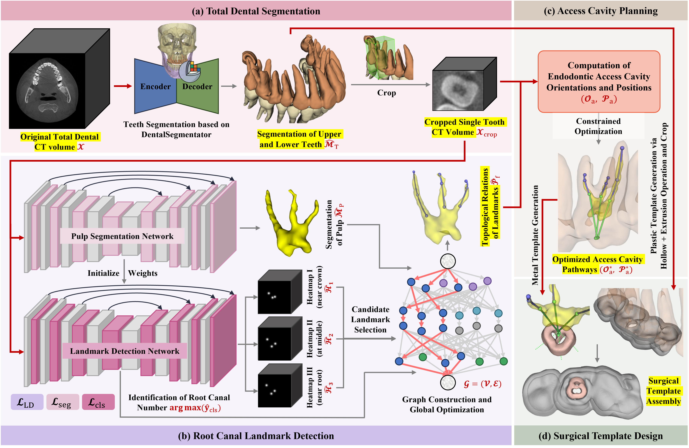

# 🦷 EndoPlanner

### An Adaptive Planning Framework for Root Canal Therapy with Graph-based Endodontic Landmark Detection and Inference-time Refinement

*Official 3D Slicer extension: `SlicerEndoPlanner`*

[](LICENSE) [](https://www.slicer.org/) [](https://www.python.org/) [](https://pytorch.org/) [](https://www.sciencedirect.com/journal/medical-image-analysis)

---

## 🎬 Video Demonstration

[](https://youtu.be/VcDCuTpR4Zw)

▶️ **[Watch the full video demonstration on YouTube.](https://youtu.be/VcDCuTpR4Zw)** It follows the complete pipeline, from a single dental CBCT scan to a ready-to-print surgical template assembly, in a matter of minutes.

---

## 📖 Introduction

Root canal therapy is one of the most frequently performed dental procedures, yet the intricate variability of root canal anatomy makes it error-prone, especially for multi-rooted teeth. Guided Endodontics improves precision and predictability, but conventional preoperative planning relies on non-dedicated software and tedious manual annotation, which renders it labor-intensive, subjective, and largely confined to single-rooted teeth.

**EndoPlanner** is an adaptive, integrated preoperative planning framework that generates clinically feasible surgical plans and templates for root canal therapy solely from oral CBCT scans, with only minimal manual intervention. It seamlessly integrates automated total dental segmentation, endodontic landmark detection, access cavity planning, and surgical template generation, and it is deployed here as the **`SlicerEndoPlanner`** extension for [3D Slicer](https://www.slicer.org/).

> [!NOTE]
> This repository accompanies our paper *"EndoPlanner: An adaptive planning framework for root canal therapy with graph-based endodontic landmark detection and inference-time refinement"*, currently **under review at *Medical Image Analysis***. The code published here is a **preview release**. The full implementation, including the trained model weights, **will be released upon publication.**

---

## 🖼️ Framework Overview

EndoPlanner is organized as four sequential stages that transform a raw CBCT volume into a manufacturable, patient-specific surgical template assembly.

[](overview.png)

| Stage | Description |
| :--- | :--- |
| **(a) Total Dental Segmentation** | Multi-label upper and lower dentition segmentation from the CBCT volume using the [`DentalSegmentator`](https://github.com/gaudot/SlicerDentalSegmentator) model, followed by single-tooth region-of-interest cropping. |
| **(b) Root Canal Landmark Detection** | A multi-task network (pulp segmentation, multi-peak heatmap regression, and root canal number classification) built on a [STU-Net](https://github.com/uni-medical/STU-Net) backbone, followed by a graph-optimization decoder that assembles candidate peaks into a structured set of root canal landmarks, together with a self-supervised inference-time refinement step that improves generalization across diverse morphologies. |
| **(c) Access Cavity Planning** | A tunable, geometry-guided constrained optimization that computes optimal, minimally invasive drill access points and pulp-cavity entry orientations from the detected landmark topology. |
| **(d) Surgical Template Generation** | Automatic generation of the two-part template assembly (a metal top sleeve guide and a plastic bottom fixation shell), directly exportable to STL files for 3D printing. |

---

## 🧩 The 3D Slicer Extension

The planning algorithms are integrated into a single, interactive 3D Slicer module with three collapsible sub-components, corresponding to the root canal landmark detection, access cavity planning, and surgical template generation stages of the framework. Each sub-component supports one-click automated output with full 3D visualization.

[](extension_fig.png)

While the workflow is highly automated, essential expert-in-the-loop interactions, such as per-stage hyper-parameter adjustment, are deliberately preserved. This modular design lets dentists oversee and refine the outputs at each processing stage as needed, thereby enhancing the reliability of the planning.

---

## ✨ Highlights

- An adaptive and integrated planning framework for root canal therapy, pioneering intelligent preoperative preparation in Guided Endodontics.
- A bottom-up encoding and graph-based decoding paradigm for root canal landmark localization and topology recognition, compatible with heterogeneous root canal anatomical morphologies.
- A self-supervised online refinement strategy that iteratively refines initial landmark predictions during inference, enhancing generalization across diverse test distributions.
- A unified, tunable, and geometry-guided algorithm for automatic access cavity planning, embedded with minimally invasive principles, accommodating complex clinical demands.
- Multiple clinical cases confirm the efficiency, reliability, and widespread application potential of our proposed framework.

---

## 📊 Results at a Glance

| Metric | Result |
| :--- | :---: |
| Mean Radial Error (landmark localization) | **0.767 mm** |
| Successful Detection Rate @ 1.0 mm / 2.0 mm | **74.9% / 94.3%** |
| End-to-end preoperative preparation time | **≈ 4 min** |
| Time reduction versus the conventional workflow | **up to 96.05%** |

Efficacy was further validated through successful in-vitro simulations and clinical cases of template-guided, minimally invasive root canal treatment.

---

## 📂 Repository Structure

```
SlicerEndoPlanner/
├── CMakeLists.txt                         # Extension build configuration
├── LICENSE                                # Apache-2.0
├── README.md
├── SlicerPulpChamberOpenPlanning.png      # Extension icon
├── overview.png                           # Framework figure
├── extension_fig.png                      # 3D Slicer screenshot
└── PulpChamberOpenPlanning/               # The scripted module
    ├── CMakeLists.txt
    ├── PulpChamberOpenPlanning.py         # Core module logic (preview release)
    ├── ModelWeights/                      # Trained weights, released upon publication
    ├── Resources/
    │   ├── Icons/
    │   └── UI/PulpChamberOpenPlanning.ui  # Module user interface
    └── Testing/
```

> [!IMPORTANT]
> The `ModelWeights/` directory is intentionally left empty in this preview. The trained weights and the complete algorithmic implementation will be released upon publication.

---

## 🛠️ Installation

1. **Install [3D Slicer](https://download.slicer.org/)** (version 5.6 or newer is recommended).
2. **Install the auxiliary extensions** used in the full workflow, via the Slicer *Extensions Manager*:
   - [`DentalSegmentator`](https://github.com/gaudot/SlicerDentalSegmentator): automated dental segmentation (Stage I).
   - `Crop Volume`: single-tooth region-of-interest extraction (built-in).
   - `Easy Clip`: interactive clipping during template design.
3. **Provide the Python dependencies** in Slicer's Python environment (the full requirements list will accompany the final release):
   ```python
   # In the Slicer Python Console
   slicer.util.pip_install("torch nibabel SimpleITK scikit-image scipy numba ortools matplotlib")
   ```
4. **Add this module** by cloning the repository and registering the `PulpChamberOpenPlanning/` folder via *Edit → Application Settings → Modules → Additional module paths*, then restart Slicer. The module then appears under the **Endodontics** category as **EndoPlanner**.

---

## 🚀 Usage

The module mirrors the four-stage framework, and each stage produces a visualizable result that feeds the next.

**Stage I: Total Dental Segmentation (auxiliary).** Segment the dentition from the CBCT with `DentalSegmentator`, then crop a single-tooth sub-volume with `Crop Volume`.

**Module 1: Root Canal Landmark Detection.** Select the input volume and an output segmentation node, then click *Apply*. The module predicts the pulp segmentation, the root canal number, and the structured set of landmark curves. The *Advanced* controls expose the decoding parameters, including the candidate count, the heatmap filter threshold, and the direction-coincidence, segmentation-proximity, and heatmap-significance edge-weight coefficients.

**Module 2: Access Cavity Planning.** Set the crown slice index (and, optionally, the pulp slice index), then click *Apply* to run the constrained optimization and obtain the optimized access cavity points and entry orientations. The *Advanced* controls expose the design preference, the per-objective weights, and the distance trade-off factor ξ that governs how conservative the access cavity is.

**Module 3: Surgical Template Generation.** Run *Stage 1* to generate the bottom fixation shell, define the cover-region ROI, then run *Stage 2* to produce the cropped plastic bottom template and the metal top sleeve guide. Both parts are automatically exported as STL files, ready for 3D printing.

---

## 📌 Citation

If you find this work useful, please consider citing our paper (the citation will be finalized upon publication):

```bibtex
@article{zhang_endoplanner,
  title   = {EndoPlanner: An adaptive planning framework for root canal therapy with graph-based endodontic landmark detection and inference-time refinement},
  author  = {Zhang, Yi and Kong, Fangyuan and Wang, Kun and Huang, Zhengwei and Chen, Xiaojun},
  journal = {Medical Image Analysis (under review)},
  note    = {Preview code: https://github.com/ZhyBrian/SlicerEndoPlanner}
}
```

---

## 📧 Contact

For questions about the method or the extension, please open an [issue](https://github.com/ZhyBrian/SlicerEndoPlanner/issues) or contact the authors:

- **Yi Zhang**, Shanghai Jiao Tong University ([@ZhyBrian](https://github.com/ZhyBrian))
- **Prof. Xiaojun Chen**, corresponding author (`xiaojunchen@sjtu.edu.cn`)
- **Prof. Zhengwei Huang**, corresponding author (`huangzhengwei@shsmu.edu.cn`)

---

## 🙏 Acknowledgements

This work builds upon the open-source community, including [3D Slicer](https://www.slicer.org/), [`DentalSegmentator`](https://github.com/gaudot/SlicerDentalSegmentator), and [STU-Net](https://github.com/uni-medical/STU-Net). We thank the Department of Endodontics and Operative Dentistry, Shanghai Ninth People's Hospital, for the clinical collaboration.

---

## 📄 License

This project is released under the [Apache License 2.0](LICENSE).
