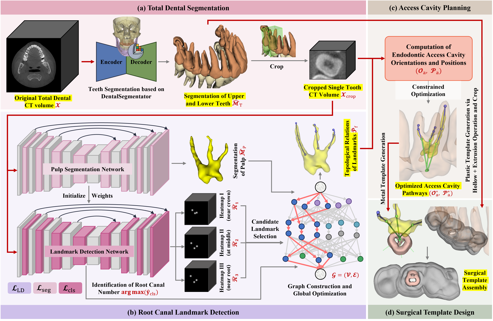

# 🦷 EndoPlanner

### An Adaptive Planning Framework for Root Canal Therapy with Graph-based Endodontic Landmark Detection and Inference-time Refinement

*Official 3D Slicer extension: `SlicerEndoPlanner`*

[](LICENSE) [](https://www.slicer.org/) [](https://www.python.org/) [](https://pytorch.org/) [](https://doi.org/10.1016/j.media.2026.104294)

---

## 📰 News

- **2026-09-04:** Updated the repository with the current 3D Slicer module implementation.
- **2026-09-04:** Released the trained model weights in [GitHub Releases](https://github.com/ZhyBrian/SlicerEndoPlanner/releases/tag/ModelWeights).
- **2026-09-02:** Our paper became [available online in *Medical Image Analysis*](https://doi.org/10.1016/j.media.2026.104294).
- **2026-08-26:** Our paper was accepted by *Medical Image Analysis*.

---

## 🎬 Video Demonstration

[](https://youtu.be/VcDCuTpR4Zw)

▶️ **[Watch the full video demonstration on YouTube.](https://youtu.be/VcDCuTpR4Zw)**

▶️ **[Watch the full video demonstration on Bilibili.](https://www.bilibili.com/video/BV1QCtB6vEjx/?vd_source=850b409ba93ba39cacbe6201c88d1871)**

It follows the planning workflow from a dental CBCT scan to a surgical template assembly that can be exported for 3D printing.

---

## 📖 Introduction

Root canal therapy is a common dental procedure, but the variability of root canal anatomy makes access preparation challenging, especially in multi-rooted teeth. Guided Endodontics improves precision and predictability through patient-specific surgical templates. Conventional planning, however, requires extensive manual annotation and modeling in software that is not designed specifically for endodontics.

**EndoPlanner** is an adaptive framework for preoperative root canal treatment planning using oral CBCT scans. It identifies root canal landmarks, uses their geometry to plan minimally invasive access paths, and generates a surgical template assembly. The workflow starts with automated dental segmentation and allows users to inspect and adjust the results at each stage. This repository provides the **`SlicerEndoPlanner`** extension for [3D Slicer](https://www.slicer.org/).

> [!NOTE]
> This repository accompanies our paper [*"EndoPlanner: An adaptive planning framework for root canal therapy with graph-based endodontic landmark detection and inference-time refinement"*](https://doi.org/10.1016/j.media.2026.104294), accepted by **Medical Image Analysis** and available online since **2 September 2026**. The 3D Slicer module code is included here, and the trained weights are available in [GitHub Releases](https://github.com/ZhyBrian/SlicerEndoPlanner/releases/tag/ModelWeights).

---

## 🖼️ Framework Overview

The framework described in the paper comprises four stages that transform a CBCT volume into a patient-specific surgical template assembly.

[](overview.png)

| Stage | Description |
| :--- | :--- |
| **(a) Total Dental Segmentation** | Multi-label upper and lower dentition segmentation from the CBCT volume using the [`DentalSegmentator`](https://github.com/gaudot/SlicerDentalSegmentator) model, followed by single-tooth region-of-interest cropping. |
| **(b) Root Canal Landmark Detection** | A multi-task network based on [STU-Net](https://github.com/uni-medical/STU-Net) predicts pulp segmentation, landmark heatmaps, and the number of canals. A graph decoder connects candidate landmarks into individual canal paths. The paper further introduces self-supervised inference-time refinement to improve adaptation to different anatomies. |
| **(c) Access Cavity Planning** | A geometric optimization computes access points and drill orientations from the detected canal paths, with adjustable objectives that balance tissue preservation and access alignment. |
| **(d) Surgical Template Generation** | A metal sleeve guide and a plastic fixation shell form a two-part assembly that can be exported as STL files for 3D printing. |

---

## 🧩 The 3D Slicer Extension

The extension provides one interactive module, displayed as **PulpChamberOpenPlanning** under the **Utilities** category in Slicer. Its three processing sections cover landmark detection, access cavity planning, and template generation. Each section produces outputs that can be inspected in the slice views and the 3D view.

[](extension_fig.png)

Users can adjust the decoding and planning parameters. Intermediate results can be inspected and manually corrected before proceeding to the next stage.

The module applies graph decoding to the outputs of the released multi-task network to recover individual canal paths. Access planning then uses this geometry to optimize entry points according to adjustable objective weights.

> [!NOTE]
> **Release scope and private training data.** To protect patient privacy, we do not publicly release our private clinical training dataset. The inference-time refinement procedure in Section 3.2.3 and Algorithm 1 of the paper retrieves similar training examples and uses their images and landmark annotations for iterative network updates. As this procedure depends on the private dataset, its implementation is not included in this repository. The released module performs landmark detection and the subsequent planning stages without access to the training dataset.
>
> The paper's evaluations show that the method retains good average landmark localization accuracy without refinement, with a modest difference in mean error on the evaluated datasets. Refinement remains valuable for reducing large errors and improving predictions in difficult cases. The [comparison below](#-results-at-a-glance) summarizes its effect in the paper's experiments; it is not a benchmark of the released module.

**Access planning implementation.** The released Slicer module follows the geometric planning principles described in Section 3.3 of the paper, with practical adaptations for interactive use. To simplify parameter configuration within Slicer, it optimizes access points with Adam and encourages containment within the reference region through an adjustable penalty weight, which remains fixed during each optimization run.

---

## ✨ Highlights

The main contributions of the paper are:

- An adaptive framework that integrates root canal treatment planning and advances intelligent preoperative preparation in Guided Endodontics.
- A bottom-up encoding and graph-based decoding paradigm that localizes root canal landmarks and recognizes their topology across heterogeneous canal anatomies.
- A self-supervised online refinement strategy that iteratively refines initial landmark predictions during inference to improve generalization across different test distributions.
- A unified algorithm that uses tunable geometric objectives to automate access cavity planning while incorporating minimally invasive principles and accommodating different clinical requirements.
- In-vitro experiments and five clinical cases provide initial evidence of efficient and reliable planning, supporting the framework's potential for broader clinical application.

---

## 📊 Results at a Glance

| Metric | Result |
| :--- | :---: |
| Mean Radial Error (landmark localization) | **0.767 mm** |
| Successful Detection Rate @ 1.0 mm / 2.0 mm | **74.9% / 94.3%** |
| End-to-end preoperative preparation time | **3 min 56 s on average** |
| Time reduction versus the conventional workflow | **up to 96.05%** |

The landmark results are from subject-level five-fold cross-validation on NPH-LDM, which contains 120 teeth from 33 patients, using the paper's full configuration with inference-time refinement. On the external ToothFairy-LDM dataset of 100 teeth, the refined predictions achieved an MRE of **0.992 mm** and an SDR of **87.4% within 2.0 mm**. The workflow timing includes dental segmentation and manual adjustments. All reported values refer to the paper's experimental evaluation.

The paper also reports the following comparison before and after inference-time refinement (Table 5 and Section 4.3.1):

| Dataset | MRE without refinement | MRE with refinement | SDR within 2.0 mm, without / with refinement |
| :--- | :---: | :---: | :---: |
| NPH-LDM | 0.832 mm | 0.767 mm | 92.2% / 94.3% |
| ToothFairy-LDM | 1.114 mm | 0.992 mm | 84.6% / 87.4% |

The differences in mean error are **0.065 mm** and **0.122 mm**, respectively. The effect on larger errors is more pronounced: on NPH-LDM, the reported maximum-error metric decreased from **5.254 mm** to **3.750 mm** after refinement. These comparisons summarize the effect of refinement under the study's evaluation protocol.

---

## 📂 Repository Structure

```
SlicerEndoPlanner/
├── CMakeLists.txt                         # Extension build configuration
├── LICENSE                                # Apache-2.0
├── README.md
├── SlicerPulpChamberOpenPlanning.png      # Extension icon
├── overview.png                           # Framework figure
├── extension_fig.png                      # 3D Slicer screenshot
└── PulpChamberOpenPlanning/               # The scripted module
    ├── CMakeLists.txt
    ├── PulpChamberOpenPlanning.py         # Module logic and algorithm implementations
    ├── ModelWeights/                      # Place the downloaded checkpoint here
    │   └── STU-NET-S-HM-CLS-V2_2026.pth  # Download separately from Releases
    ├── Resources/
    │   ├── Icons/
    │   └── UI/PulpChamberOpenPlanning.ui  # Module user interface
    └── Testing/
```

---

## 📥 Model Weights

Download **[STU-NET-S-HM-CLS-V2_2026.pth](https://github.com/ZhyBrian/SlicerEndoPlanner/releases/download/ModelWeights/STU-NET-S-HM-CLS-V2_2026.pth)** from the [ModelWeights release](https://github.com/ZhyBrian/SlicerEndoPlanner/releases/tag/ModelWeights).

> [!IMPORTANT]
> Move the downloaded file into **`PulpChamberOpenPlanning/ModelWeights/`** before running landmark detection. Create the folder if it does not exist, and keep the filename **`STU-NET-S-HM-CLS-V2_2026.pth`** unchanged. The required path, relative to the repository root, is:
>
> ```text
> PulpChamberOpenPlanning/ModelWeights/STU-NET-S-HM-CLS-V2_2026.pth
> ```

The checkpoint supplies the segmentation, landmark heatmap, and canal-count outputs used by the current module. No separate pulp-segmentation checkpoint is needed for this workflow. Model weights are distributed through Releases and are not included in a Git clone or source archive. Obtain the module code from the repository's `main` branch and download the `.pth` asset separately.

> [!NOTE]
> **Generalization and manual refinement.** The root canal landmark detection network in stage (b) was trained on a limited dataset and may not generalize well to every CBCT scan. Results can be inspected and manually adjusted at each stage before proceeding to the next step.
>
> We welcome further work that builds on the method described in our paper to expand the training data using public resources such as [ToothFairy4](https://ditto.ing.unimore.it/toothfairy4/) or private datasets. With suitable annotations, these data can be used to retrain or fine-tune the network, with the aim of improving robustness on unseen data.

---

## 🛠️ Installation

1. **Install [3D Slicer](https://download.slicer.org/).** The reference application environment is **Slicer 5.7.0, build 2024-07-15, on 64-bit Windows**, with **Python 3.9.10**. The pinned setup below targets this environment. Landmark detection requires an NVIDIA GPU with a driver compatible with CUDA 12.1. The experiments reported in the paper used Python 3.9.21 and PyTorch 2.6.0; the extension's reference runtime is documented below.
2. **Prepare the supporting modules.** Install [`DentalSegmentator`](https://github.com/gaudot/SlicerDentalSegmentator) through Slicer's *Extensions Manager*. Complete the NNUNet dependency setup requested by DentalSegmentator before applying the version pins below. `Crop Volume`, used to extract a single tooth, is built into Slicer. `Easy Clip` is optional for additional manual clipping and is also available through the *Extensions Manager*.
3. **Install the Python dependencies in Slicer's Python environment.** The versions below were inspected in the local application, and the scientific Python imports and key numerical operations were checked with its `PythonSlicer` executable.

   | Package | Local reference version |
   | :--- | :--- |
   | PyTorch | `2.3.1+cu121` |
   | NumPy | `1.26.4` |
   | SciPy | `1.13.1` |
   | NiBabel | `5.2.1` |
   | scikit-image | `0.24.0` |
   | OR-Tools | `9.3.10497` |
   | Numba | `0.60.0` |
   | Matplotlib | `3.9.1` |
   | SimpleITK | `2.4.0rc2.dev213`, supplied with this Slicer build |

   For a new environment matching the reference Slicer build, run the following in **Slicer's Python Console**. The PyTorch command uses the official [CUDA 12.1 wheel distribution](https://pytorch.org/get-started/previous-versions/#v231). If you already have a working installation, compare its versions with the table before changing packages.

   ```python
   import slicer

   slicer.util.pip_install(
       "torch==2.3.1+cu121 --index-url https://download.pytorch.org/whl/cu121"
   )
   slicer.util.pip_install(
       "numpy==1.26.4 scipy==1.13.1 nibabel==5.2.1 "
       "scikit-image==0.24.0 ortools==9.3.10497 "
       "numba==0.60.0 llvmlite==0.43.0 protobuf==5.28.0 "
       "matplotlib==3.9.2"
   )
   ```

   The scikit-image and OR-Tools pins preserve the `skeletonize_3d` and `pywrapgraph` APIs used by the current code. These APIs changed in [scikit-image 0.25](https://scikit-image.org/docs/0.25.x/release_notes/release_0.25.html#api-changes) and [OR-Tools 9.4](https://github.com/google/or-tools/discussions/3425). NumPy and SciPy are pinned to the local versions to keep the numerical stack consistent. The `llvmlite` and `protobuf` pins also match the installed dependencies of Numba and OR-Tools.

   **Matplotlib is the one deliberate difference from the local reference.** Version 3.9.1 was [withdrawn from PyPI because of problems with its Windows wheels](https://pypi.org/project/matplotlib/3.9.1/). New installations use `3.9.2`, which [corrected the Windows runtime bundling](https://matplotlib.org/3.9.2/api/prev_api_changes/api_changes_3.9.2.html#windows-wheel-runtime-bundling-made-static). This installation recommendation is based on the upstream fix; the local checks used the existing `3.9.1` installation.

   Keep the SimpleITK installation supplied with Slicer. Its development version above is recorded for reference and should not be installed separately from PyPI. Slicer also provides its own VTK and Qt bindings, together with the MRML classes and Segment Editor components used by the module. These application components do not need separate pip installation. The remaining standard-library imports are included with Python.

   **Restart Slicer after installing packages**, then check the key imports and CUDA availability in its Python Console:

   ```python
   import torch
   from ortools.graph import pywrapgraph
   from skimage.morphology import skeletonize_3d

   assert torch.cuda.is_available(), "Landmark detection requires a CUDA-capable GPU."
   print("PyTorch:", torch.__version__, "CUDA:", torch.version.cuda)
   ```

4. **Clone the repository** into a writable location:
   ```bash
   git clone https://github.com/ZhyBrian/SlicerEndoPlanner.git
   ```
5. **Download and place the model weights** as described in [Model Weights](#-model-weights).
6. **Register the module folder** `SlicerEndoPlanner/PulpChamberOpenPlanning/` via *Edit → Application Settings → Modules → Additional module paths*, then restart Slicer. Open **Utilities → PulpChamberOpenPlanning**. The module writes intermediate results and exported templates into `TmpFiles*` subfolders beside its Python file, so this location must remain writable.

---

## 🚀 Usage

Follow the four stages illustrated in Fig. 2 of the paper. Stage I uses supporting Slicer modules, followed by the three processing sections in this extension. Inspect each result and make any necessary manual corrections before continuing.

**Stage I: Total Dental Segmentation (auxiliary).** Segment the dentition from the CBCT with `DentalSegmentator`, then crop a single-tooth sub-volume with `Crop Volume`. In *General Inputs*, select the cropped tooth as *Input volume*, the original CBCT as *Input super volume*, and the full dental segmentation as *Total dental segmentation*.

**Stage II: Root Canal Landmark Detection (Module 1).** In *Root Canal Landmark Detection*, select an output node for *Root canal segmentation*. Leave *Root canal path number* on *Decide automatically*, or specify the canal count if needed. Click *Apply* to predict the pulp mask and canal count and decode the landmarks into canal curves. The *Advanced* controls adjust candidate selection and the contributions of canal direction, pulp-skeleton proximity, and heatmap confidence to graph decoding. Inspect the segmentation and adjust the curve control points as needed before proceeding.

**Stage III: Access Cavity Planning (Module 2).** In *Root Canal Path Optimization*, use the pulp segmentation from Stage II and select a separate output node for *Reference pulp section*. In the Red slice view, choose the crown reference slice and click *Set current slice as z-index of tooth crown*. Leave the pulp slice on *Decide automatically*, or set it manually if needed. Adjust *Design preference* and the objective weights under *Advanced*, then click *Apply* to generate the access paths. The *Mutual distance intensity* control adjusts the preferred spacing between access points, helping balance access geometry and tissue preservation.

**Stage IV: Surgical Template Generation (Module 3).** *Guide Plate Design* completes this stage in two internal steps. First, select *Upper teeth* or *Lower teeth*, choose an output node for *Bottom guide before cropped*, and click the first *Apply* button to generate a fixation shell. Inspect and adjust the shell, then use it as the input for the second step. Define the *Guide plate cover region ROI* and select separate output nodes for *Bottom guide plate* and *Top guide plate*. Click the second *Apply* button to generate the plastic bottom template and metal top sleeve guide from the shell and the planned access paths. Both parts are exported as STL files to `PulpChamberOpenPlanning/TmpFilesGPD/` for subsequent 3D printing.

---

## 📌 Citation

If you find this work useful, please cite our [paper in *Medical Image Analysis*](https://doi.org/10.1016/j.media.2026.104294):

```bibtex
@article{zhang2026endoplanner,
  title   = {EndoPlanner: An adaptive planning framework for root canal therapy with graph-based endodontic landmark detection and inference-time refinement},
  author  = {Zhang, Yi and Kong, Fangyuan and Wang, Kun and Huang, Zhengwei and Chen, Xiaojun},
  journal = {Medical Image Analysis},
  year    = {2026},
  doi     = {10.1016/j.media.2026.104294},
  url     = {https://doi.org/10.1016/j.media.2026.104294}
}
```

---

## 📧 Contact

For questions about the method or the extension, please open an [issue](https://github.com/ZhyBrian/SlicerEndoPlanner/issues) or contact the authors:

- **Yi Zhang**, Shanghai Jiao Tong University ([@ZhyBrian](https://github.com/ZhyBrian))
- **Prof. Xiaojun Chen**, corresponding author (`xiaojunchen@sjtu.edu.cn`)
- **Prof. Zhengwei Huang**, corresponding author (`huangzhengwei@shsmu.edu.cn`)

---

## 🙏 Acknowledgements

This work builds upon the open-source community, including [3D Slicer](https://www.slicer.org/), [`DentalSegmentator`](https://github.com/gaudot/SlicerDentalSegmentator), and [STU-Net](https://github.com/uni-medical/STU-Net). We thank the Department of Endodontics, Shanghai Ninth People's Hospital, for the clinical collaboration.

We also thank the [ToothFairy4](https://ditto.ing.unimore.it/toothfairy4/) team for making CBCT data available to the research community.

---

## 📄 License

This project is released under the [Apache License 2.0](LICENSE).
